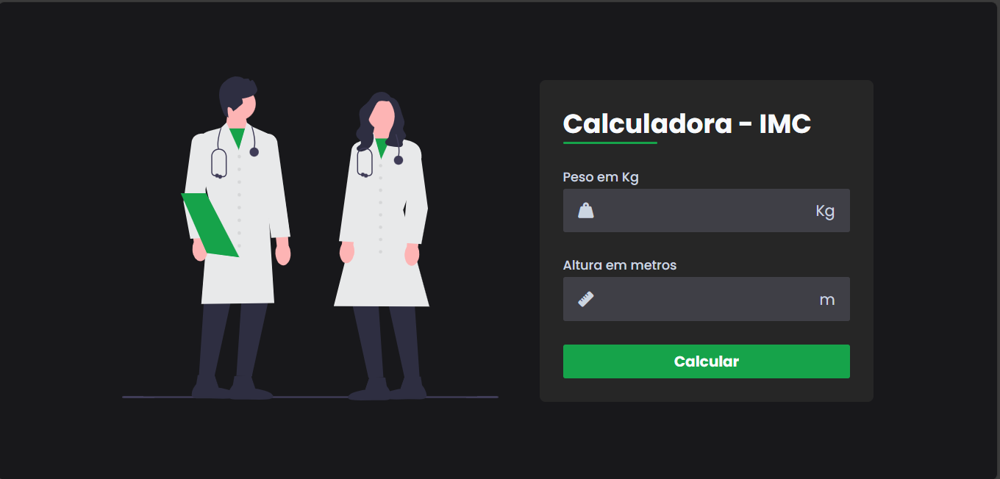

# 🧮 Calculator-BMI

A simple Body Mass Index (BMI) calculator built with HTML, CSS, and JavaScript.

---
  
  

## 📋 Table of Contents

- [About](#about)  
- [Features](#features)  
- [How to Use](#how-to-use)  
- [Local Installation / Running](#local-installation--running)  
- [Technologies](#technologies)  
- [Contributing](#contributing)  
- [License](#license)  

---

## About

This project allows users to enter their weight and height, calculates their BMI, and displays a corresponding health classification (underweight, normal weight, overweight, obesity).  

It is ideal as a lightweight front-end exercise or as a quick tool for learning purposes.

---

## Features

- Input for weight (in kg) and height (in meters or centimeters)  
- Automatic BMI calculation  
- Visual/textual classification of the result  
- Responsive layout / simple user interface  
- Validation/error messages for incorrect inputs  

---

## How to Use

1. Clone this repository:  
   ```bash
   git clone https://github.com/MoiRaibolt/Calculator-BMI.git
2. Navigate into the project folder:

   cd Calculator-BMI


3. Open index.html in your browser (double-click or via a local server).

4. Enter your height and weight, click the "Calculate" button, and see your BMI result.

Local Installation / Running

No special installation is required — just open index.html.

Optionally, you can run it on a local server (e.g., VSCode Live Server, Python http.server, etc.) for better testing.

Technologies

HTML5

CSS3

JavaScript (Vanilla)

(Optional: include any additional frameworks or libraries if used)


Contributing

Contributions are welcome! If you find bugs, have ideas for improvements, or want to add features:

1. Open an issue describing your suggestion or problem.

2. Fork the project, create a feature branch, commit your changes, and open a pull request.

Ma3. ke sure your code is well-documented and works in common browsers.

License

This project is licensed under the MIT License — see the LICENSE
file for details.
